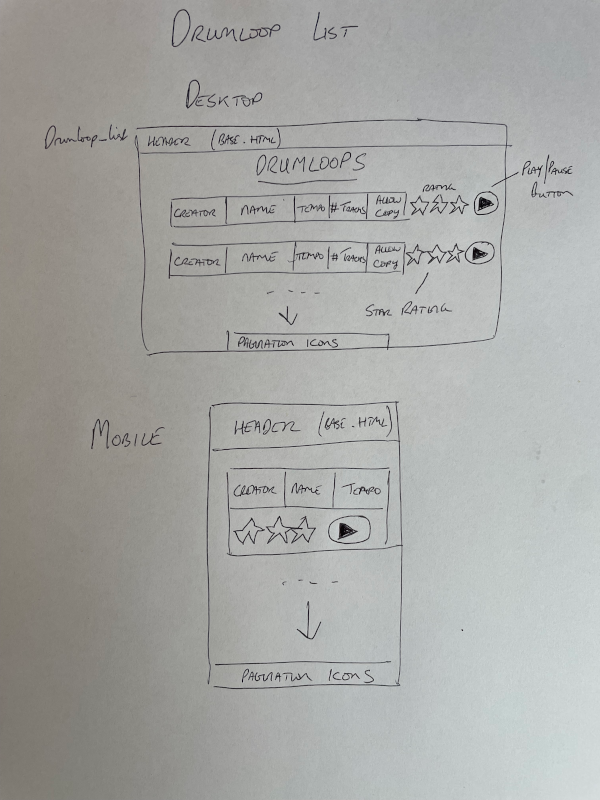
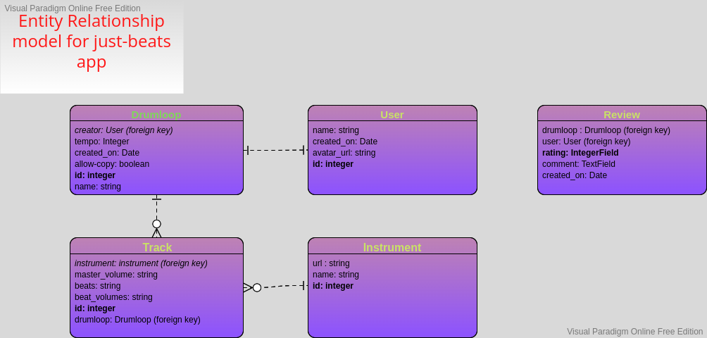

# just-beats
Make your own drum loops on the web

[Screenshots](#Screenshots)

[Features](#Features)

[User Experience](#User-Experience)

[Development Process](#Development-Process)

[Testing](#Testing)

[Bugs](#Bugs)

[Deployment](#Deployment)

[Credits](#Credits

## Screenshots

[Return to top](#just-beats)

## Features

### Future Features

[Return to top](#just-beats)
# User Experience

## User Stories

## Design

### Wireframes

[Return to top](#just-beats)

# Development Process

### Inline JavaScript and event handlers.
When using Django templates, the fields passed in from the backend are only 
available within the HTML document itself. It is therefore simpler to write event
handlers directly into the document, rather than in external JS files. This means that
the HTML and JavaScript are tightly coupled, but this would be necessary in any case 
in the absence of direct fetch calls to the API. 

## Data Model

# Testing
- Manual testing
- Automated testing
- In-app testing
- User story testing
- Validator testing

## Manual Testing

## Automated Testing

## User Story Testing

## Validator Testing

[Return to top](#just-beats)

# Bugs

Google social authentication: Error 400 redirect_uri_mismatch. The problem was caused by the redirect uri
I supplied to Google when setting up the credentials having a missing trailing slash at the end. 
https://www.youtube.com/watch?v=QHz1Rs6lZHQ&t=1s

## Solved Bugs

## Remaining Bugs

[Return to top](#just-beats)

## Libraries and Programs Used
1. [Lucid](https://www.lucidchart.com/pages/)
    - Lucid charts were used to create the execution path diagrams.
2. [Heroku](https://www.heroku.com/)
    - Heroku was used to deploy the project
3. [Git](https://git-scm.com/)
    - Version control was implemented using Git through the Github terminal.
4. [Github](https://github.com/)
    - Github was used to store the projects after being pushed from Git and its cloud service [Github Pages](https://pages.github.com/) was used to serve the project on the web.
5. [Visual Studio Code](https://code.visualstudio.com/)
    - VS Code was used locally as the main IDE environment, primarily because it was easier to set up a development environment locally than in GitPod (I wasn't sure how to persist the Jest installation across different GitPod sessions)
6. [PyCharm-Community](https://www.jetbrains.com/pycharm/)
    - I switched to PyCharm towards the end of the project, as it has better support for PEP8 compliance.
7. [pytest](https://docs.pytest.org/en/7.1.x/)
    - Pytest was used for automated testing.

## Deployment

[Return to top](#just-beats)
## Credits
Cloning a string in javascript:
https://stackoverflow.com/questions/31712808/how-to-force-javascript-to-deep-copy-a-string

Creating an audio sequencer:
https://developer.mozilla.org/en-US/docs/Web/API/Web_Audio_API/Advanced_techniques

Bit shifting in Javascript:
https://developer.mozilla.org/en-US/docs/Web/JavaScript/Reference/Operators/Unsigned_right_shift

Hashing a string: 
https://stackoverflow.com/questions/7616461/generate-a-hash-from-string-in-javascript

Configuring Google social login using allauth
https://django-allauth.readthedocs.io/en/latest/installation.html

Django authentication with Google
https://www.codeunderscored.com/django-authentication-with-google/

[Return to top](#just-beats)
