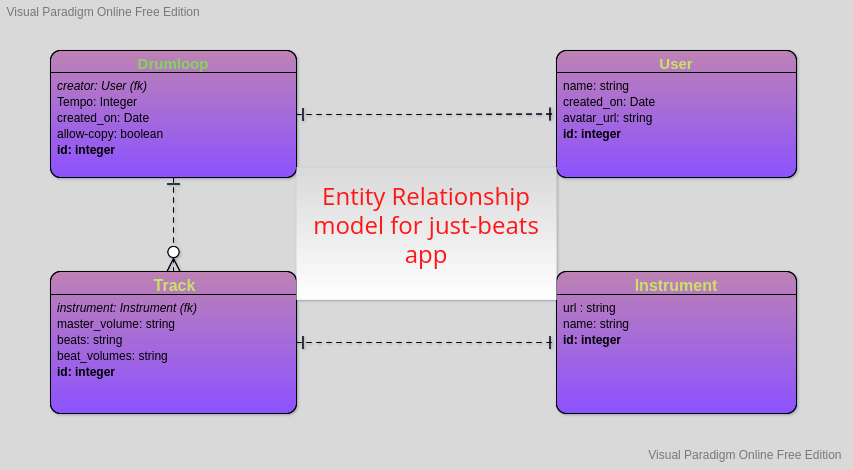

# just-beats
Make your own drum loops on the web

[Screenshots](#Screenshots)

[Features](#Features)

[User Experience](#User-Experience)

[Development Process](#Development-Process)

[Testing](#Testing)

[Bugs](#Bugs)

[Deployment](#Deployment)

[Credits](#Credits

## Screenshots

[Return to top](#just-beats)

## Features

### Future Features

[Return to top](#just-beats)
# User Experience

## User Stories

## Design

[Return to top](#just-beats)

# Development Process

## Data Model

# Testing
- Manual testing
- Automated testing
- In-app testing
- User story testing
- Validator testing

## Manual Testing

## Automated Testing

## User Story Testing

## Validator Testing

[Return to top](#just-beats)

# Bugs
## Solved Bugs

## Remaining Bugs

[Return to top](#just-beats)

## Libraries and Programs Used
1. [Lucid](https://www.lucidchart.com/pages/)
    - Lucid charts were used to create the execution path diagrams.
2. [Heroku](https://www.heroku.com/)
    - Heroku was used to deploy the project
3. [Git](https://git-scm.com/)
    - Version control was implemented using Git through the Github terminal.
4. [Github](https://github.com/)
    - Github was used to store the projects after being pushed from Git and its cloud service [Github Pages](https://pages.github.com/) was used to serve the project on the web.
5. [Visual Studio Code](https://code.visualstudio.com/)
    - VS Code was used locally as the main IDE environment, primarily because it was easier to set up a development environment locally than in GitPod (I wasn't sure how to persist the Jest installation across different GitPod sessions)
6. [PyCharm-Community](https://www.jetbrains.com/pycharm/)
    - I switched to PyCharm towards the end of the project, as it has better support for PEP8 compliance.
7. [pytest](https://docs.pytest.org/en/7.1.x/)
    - Pytest was used for automated testing.

## Deployment

[Return to top](#just-beats)
## Credits
Cloning a string in javascript:
https://stackoverflow.com/questions/31712808/how-to-force-javascript-to-deep-copy-a-string

Creating an audio sequencer:
https://developer.mozilla.org/en-US/docs/Web/API/Web_Audio_API/Advanced_techniques

[Return to top](#just-beats)
