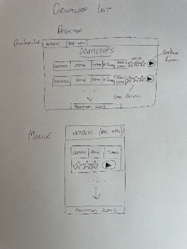
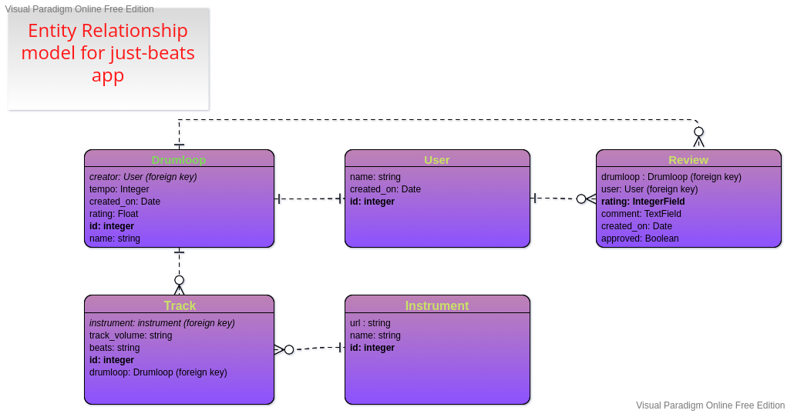

# just-beats
Make your own drum loops on the web

## Purpose of Project
The aim of the project is to allow users to create and edit drum loops using
a custom GUI, and save them to a database. Users can also (if logged in) comment
on and rate other users' loops to provide a social element to the site.

---

## Links to content

[Features](#Features)

[User Experience](#User-Experience)
- [Design](#design)
    - [Fonts](#fonts)
    - [Colour](#colour)
    - [Wireframes](#wireframes)

[Development Process](#Development-Process)
- [Project Planning](#project-planning-and-documentation-in-github)
- [Inline JavaScript](#inline-javascript-and-event-handlers)
- [Data Model](#data-model)

[Testing](#Testing)
- [Manual Testing](#manual-testing)
    - [Feature Testing](#feature-testing)
    - [Responsiveness](#responsiveness)
    - [Browser Compatibility](#browser-compatibility)
    - [Lighthouse](#lighthouse)
    - [Code Validation](#code-validation)
        - [Python](#python-code)
        - [JavaScript](#javascript-code)
        - [HTML](#html-validation)
        - [CSS](#css-validation)
    - [User Stories](#user-stories)
- [Automated Testing](#automated-testing)
    - [Django testing](#testing-django-views-models-and-forms)
    - [Selenium testing](#testing-page-functionality-with-selenium)

[Bugs](#Bugs)

[Libraries and Programs Used](#libraries-and-programs-used)

[Deployment](#Deployment)

[Credits](#Credits)

---

## Features
- **Homepage** : 
The user is first shown a list of all the saved drumloops, ordered by rating, 
and can listen to any of these. Clicking on the play button plays the loop, and also
brings up a display at the bottom of the page with the loop name and a button to
allow the user to rate and comment on the loop (only possible with other users' loops, 
not the current user's own loops). If logged in, the user can click a button to see just 
their own loops, which will have an edit button beside them linking to the loop_editor page.

- **Loop Editor Page** :
The user is shown a display representing the current loop. At the top there are 3 inputs - 
Loop Name, Creator(not editable) and Tempo (a number input). Below this is a table containing
a row for each track. Each row consists of the instrument name (clickable to change instrument), 
the track volume (a slider), the beats display (a div for each beat which toggles when
clicked) and a delete button, which allows the user remove that track permanently (requires
confirmation). At the bottom are 4 buttons - Play, Add New Track, Save and Delete Loop.
The page also provides three modals; one each to confirm deletion of a track or the whole loop, 
and an instrument chooser modal which displays a table containing all available instruments, with 
the current choice highlighted.

- **Loop Detail Page**:
This page was added late in the project, at the suggestion of my mentor, Celestine Okoro. The page collects and displays all the information associated with a particular loop, including the 5 most recent reviews, a graphic showing the beats of each track, a play/pause button, a volume control and a link to the rating
page. Various animations are displayed when the user hits the play button to hear the audio. A visitor to
the site does not need to be authenticated to view this page, and it contains a span with a link to the page and a copy button that transfers the link to the visitor's clipboard to facilitate sharing.  

- **Loop Rating and Comments** :
The user, if logged in, can rate and comment on drumloops by other users (the rating link is
disabled for a user's own loops - you can't let people rate themselves!). All previous comments 
on the chosen loop and the respective ratings are shown in a dialog on the left hand side (on top on mobile). A simple form with 2 editable inputs - for the numerical rating and the comment - appears on the right-hand side (below on mobile).

- **Messaging** : 
Messaging is handled by two separate processes, both of which write to the same dedicated div just below the navbar. Standard Django messages are dispatched from the backend and displayed as the page is loaded/reloaded. As these messages are embedded in templates, they can only be shown to the user when a page is loaded. For actions that are carried out using POST requests, such as saving the tracks and loop information, JavaScript is used to write confirmation and error messages to the same div on the page. In both cases, a script removes the message again after a short delay.

### Future Features
- A useful possible future feature would be the ability to accept an audio sample from the user, 
save it to media storage, and make it available to all users as one of the instrument choices once it had been approved by an admin or staff member.
- It might also be useful to use the staff feature of the Django User model to allow staff members to 
approve ratings and comments, without allowing them full admin access to the database.
- The app could be expanded to allow the use of musical instruments as well as drum beats and samples alone.

[Return to top](#just-beats)
# User Experience

## Design

### Fonts 
- The main text font used for ordinary text in the body of the project was 'Kanit', which I obtained from Google Fonts. It's a very legible sans-serif font, whose glyphs have a blocky shape that suits the graffiti theme in the site as a whole.

- The font used for headings and labels is 'Wallpoet', which is similar in appearance to a stencil. It was sourced from [this website](https://www.1001fonts.com/graffiti-fonts.html). Thanks to [Lars Berggman](https://www.1001fonts.com/users/punktlars/).

- The font used for the site logo is 'Future', which is slightly less readable but looks more like what a graffiti artist would draw with a can of spraypaing. It was sourced from the same site as 'wallpoet' - thanks to [PressGangStudios](https://www.1001fonts.com/users/pressgang/).

### Colour
The main image, of a large dark hall with columns covered in graffiti, was sourced from [pexels](www.pexels.com) - thanks to [Paul Basel](https://www.pexels.com/@paul-basel-903490/). As it is dark, I decided to put most of the content inside boxes with an opaque darker overlay, and use white as the font colour throughout to ensure a good contrast between foreground and background. Headings are in yellow or yellow green, which both contrast well against a dark background. For variety, the list of loops on the homepage is black text and gold stars on a light grey background.

### Wireframes
I decided to draw the wireframes out by hand for this project, as the free wireframe
prototyping services I had used for previous projects take quite a while to set up. In
the interests of productivity, I went for the quicker option of pen and paper.

[Return to top](#just-beats)

# Development Process

## Project planning and documentation in GitHub

GitHub Issues were used to document the development steps undertaken in the project. Two issue templates, 
for [User Epics](https://github.com/johnrearden/just-beats/issues/new?assignees=&labels=&template=user-epic.md&title=USER+EPIC+%3A+%3CTITLE%3E) and [User Stories](https://github.com/johnrearden/just-beats/issues/new?assignees=johnrearden&labels=&template=user-story.md&title=USER+STORY+%3A+%3CTITLE%3E) were used. Various labels were employed to enable quick identification of issue type including Bugs, User Epics, User Stories and Style. MoSCoW prioritisation was employed using the labels must-have, should-have and could-have. 

To break the project into manageable sprints, GitHub Projects was used to provide a Kanban board
onto which the issues were posted, moving them from 'Todo' to 'In Progress' to 'Done' as they 
were completed in turn. The iterations are documented here - [Iteration 1](https://github.com/users/johnrearden/projects/4), [Iteration 2](https://github.com/users/johnrearden/projects/5) and [Iteration 3](https://github.com/users/johnrearden/projects/6)

The User Epics and their related User Stories are as follows:
- Epic : [Create Drum Loops](https://github.com/johnrearden/just-beats/issues/2).
    - Story : [Load basic drum template](https://github.com/johnrearden/just-beats/issues/5#issue-1393424794)
    - Story : [Toggle beats on and off](https://github.com/johnrearden/just-beats/issues/6#issue-1393425523)
- Epic : [Listen to other users' loops](https://github.com/johnrearden/just-beats/issues/4)
    - Story : [Create list view of all drumloops ordered by rating]()
    - Story : [Allow user to preview loops without switching to loop editor view](https://github.com/johnrearden/just-beats/issues/19)
- Epic : [Create an account](https://github.com/johnrearden/just-beats/issues/1)
    - Story : [User account creation using all-auth](https://github.com/johnrearden/just-beats/issues/15#issue-1406144429)
    - Story : [Styling the user account views](https://github.com/johnrearden/just-beats/issues/16)
    - Story : [Social sign in](https://github.com/johnrearden/just-beats/issues/17)
- Epic : [Play drum loops](https://github.com/johnrearden/just-beats/issues/10)
    - Story : [Play/pause drumloop audio](https://github.com/johnrearden/just-beats/issues/11)
    - Story : [Change track volume](https://github.com/johnrearden/just-beats/issues/12)
- Epic : [Edit my drum loops](https://github.com/johnrearden/just-beats/issues/3)
    - Story : [Add new track to drumloop](https://github.com/johnrearden/just-beats/issues/7#issue-1393427818)
    - Story : [Change instrument on a track](https://github.com/johnrearden/just-beats/issues/8#issue-1393428524)
    - Story : [Change drumloop tempo](https://github.com/johnrearden/just-beats/issues/13#issue-1393439736)
    - Story : [Save drumloop](https://github.com/johnrearden/just-beats/issues/9#issue-1393429114)
    - Story : [Delete existing track](https://github.com/johnrearden/just-beats/issues/21#issue-1428735119)
- Epic : [Rating other users' loops](https://github.com/johnrearden/just-beats/issues/22)
    - Story : [Give a star rating to someone else's loop](https://github.com/johnrearden/just-beats/issues/23#issue-1436561054)
    - Story : [Make a comment on someone else's loop](https://github.com/johnrearden/just-beats/issues/24#issue-1436564637)
    - Story : [Allow admin to moderate comments before publishing](https://github.com/johnrearden/just-beats/issues/25)
- Epic : [Enhance user engagement](https://github.com/johnrearden/just-beats/issues/34#issue-1473376685)
    - Story : [Allow users to share a link to a drumloop](https://github.com/johnrearden/just-beats/issues/35)
    - Story : [Add animations synchronised with audio playback](https://github.com/johnrearden/just-beats/issues/36#issue-1473393530)

## Inline JavaScript and event handlers.
When using Django templates, the fields passed in from the backend are only 
available within the HTML document itself. It is therefore simpler to write event
handlers directly into the document, rather than in external JS files. This means that
the HTML and JavaScript are tightly coupled, but this would be necessary in any case 
in the absence of direct fetch calls to the API. 

## Data Model

- Data validation
    - **Drumloop model**. This model has two field that the user has control over - name and tempo. The name field is set to unique in the model, and attempting to enter a name that already exists in the database will result in the new drumloop form being returned to the user with an error message informing them of this conflict. The tempo field in the form has a NumberInput widget specified with a min and max value, which will prevent the user from using the arrow keys on the widget to select a tempo outside the legal range. The model itself has min and max validators, so even if the user enters an illegal tempo using the keyboard, e.g. 34 or 322, the form will be returned to them with the appropriate error. The creator field is set on the form and hidden to the user, and so cannot be altered by them.
    - **Track model** The track model does not have fields that the user can alter through text entry. The volume field can be altered in the drum editor, but its validity (0 <= volume <= 10) is ensured by the min and max attributes on the volume range input, and the Min- and MaxValueValidators on the model itself. The beats field necessarily has 32 characters corresponding to the 32 beat divs on the Loop Editor page, whose number cannot be changed by the user, and their values ('8' for on and '0' for off) are set in code in response to click events on the beat divs, and as such the user cannot alter them. The instrument can only be altered by clicking on one of the selections in the instrument modal, which protects this field from invalid modification.
    - **Instrument model** The instrument model fields are not exposed to the user at any time.
    - **Review model** The review model has a number of fields that are exposed to the user. The comment field has a max length, so the user can only type that many characters. If more characters than are allowed are pasted into the textarea, only the max limit number of characters will actually be saved to the database. The rating field can only be altered in the rating form, and is controlled by a number input with min and max values set. Pasting an out of range value into the input will result in an error on the client side, informing the user of their mistake. The reviewer and drumloop fields are handled by HiddenInput fields in the ReviewForm class, and as such are not exposed to the user at all. The approved field is also not exposed in the form, and is set to false by default. This field can only be set to true by the superuser account.
    - **User model** The default Django User model is used, so validation is handled by the framework.

# Testing
- Manual testing
- Automated testing
- In-app testing
- User story testing
- Validator testing

---

## Manual Testing

### Feature Testing

|Page|Feature|Action|Effect|
|---|---|---|---|
|Homepage|Site Logo|Click|Redirects to home page from all pages|
|Homepage|Logged In User Display|Log in as existing user|Username appears in navbar|
|Homepage|Home link|Click|Redirects to home page from all pages|
|Homepage|Logout link|Click|Redirects to confirm signout page|
|Homepage|Confirm logout|Click 'ok'|Redirects to home page|
|Homepage|Login link|Click|Redirects to Sign In Page|
|Homepage|Register link|Click|Redirects to Sign Up Page|
|Homepage|All Loops Button|Click|All loops displayed on homepage|
|Homepage|My Loops Button|Not logged in|Button is disabled|
|Homepage|My Loops Button|Logged in : click|Only user's loops are displayed|
|Homepage|Edit Button|Logged out|Not visible|
|Homepage|Edit Button|Logged in : click|Visible - redirects to Loop Editor Page|
|Homepage|Loop row|Hover on row|Row is highlighted in green|
|Homepage|Loop row|Click|Redirects to Loop Detail Page for this selected loop|
|Homepage|Call-to-Action New Loop Button|Logged in : click|Redirects to Create New Loop Form|
|Homepage|Call-to-Action login button|Logged out : click|Redirects to Login Page|
|Homepage|Message on login|Login as user|Successful Signin message appears, clears after 3 seconds|
|Homepage|Message on logout|Logout|Successful signout message appears, clears after 3 seconds|
|Login Page|Social sign-in button|Click|Redirects to confirm social signin page|
|Login Page|Social sign-in continue button|Click|Redirects to Sign in with Google page|
|Login Page|Username validation|Enter incorrect username|Error message response - does not specify if username or password failed|
|Login Page|Password validation|Enter incorrect password|Error message response - does not specify if username or password failed|
|Login Page|Remember me button|Checkbox on|Close browser window and reopen - user still logged in|
|Login Page|Sign in button|Click|Redirects to home page, shows successful login message|
|Logout Confirm Page|Sign Out button|Click|Redirects to home page, user logged out|
|Register Page|Reroute to login page|Click link|Redirects to login page|
|Register Page|Username validation|Try using existing username|Error message appears - 'A user with that username already exists'|
|Register Page|email validation|Entered invalid email (without '@'|Error message - 'Please enter valid email address' and registration fails|
|Register Page|password1|Enter a short password|Error message - 'That password is too short'|
|Register Page|password2|Enter different password to password1 field|Error message - 'You must type the same password each time'|
|Register Page|Sign Up button|Entered valid form data|Redirects to home page - success message displayed|
|Loop Detail Page|Loop name display|No action|Loop name displays correctly|
|Loop Detail Page|Creator display|No action|Creator name displays correctly|
|Loop Detail Page|Track beat display|No action|All tracks present, all beats present|
|Loop Detail Page|Track beat animation|Click play button|Each beat highlighted in time on each track|
|Loop Detail Page|Site logo animation|Click play button|Logo grows on every 16th beat, and then slowly shrinks|
|Loop Detail Page|Play button|Click|Audio playback and animations begin|
|Loop Detail Page|Play button|Hover|Button appearance changes|
|Loop Detail Page|Pause button|Click|Audio playback and animations cease|
|Loop Detail Page|Play/pause button animation|Click to play|Button icon rotates quickly at beginning of every 16th beat|
|Loop Detail Page|Volume Input|Click on up and down buttons on input|Volume immediately goes up and down|
|Loop Detail Page|Share link display|No action|current url displayed|
|Loop Detail Page|Share link copy button|Click|link successfully copied to clipboard|
|Loop Detail Page|Rating button|Click|Redirects to rating page|
|Loop Detail Page|Rating button when logged out|No action|Not shown|
|Loop Editor Page|Loop name display|No action|Loop name displayed correctly|
|Loop Editor Page|Creator display|No action|Creator name displayed correctly|
|Loop Editor Page|Tempo control|Click arrow buttons to increase and decrease value|Tempo increases and decreases immediately as audio plays|
|Loop Editor Page|Instrument button|Click|Instrument modal shown, current instrument highlighted|
|Loop Editor Page|Instrument modal|Click on option|Sample plays once|
|Loop Editor Page|Instrument modal dismiss|Click outside modal or close button|Modal is hidden|
|Loop Editor Page|Instrument modal save button|Save clicked|Modal hidden, instrument updated|
|Loop Editor Page|Instrument change message|No action|Instrument changed message shown, fades after 3 sec|
|Loop Editor Page|Track volume control|Adjust slider|Volume of track changes in real time|
|Loop Editor Page|Beat toggle|Toggle on|Beat is now heard in playback, beat div highlighted|
|Loop Editor Page|Delete track button|Click|Confirm delete track modal shown|
|Loop Editor Page|Confirm delete track|Click|Track deleted and confirmation message shown|
|Loop Editor Page|Refuse delete track|Click|No change to loop|
|Loop Editor Page|Play button|Click|Audio playback and animations begin, icon changes to pause|
|Loop Editor Page|Pause button|Click|Audio playback and animations end, icon changes to play|
|Loop Editor Page|Loop volume control|Click on up and down arrow buttons|Overall playback volume increases and decreases|
|Loop Editor Page|Add new track button|Click|Instrument modal shown, after save clicked, new track appears with chosen instrument|
|Loop Editor Page|Delete Loop Button|Click|Confirm delete loop modal appears|
|Loop Editor Page|Delete Loop confirm|Click|Redirects to homepage, success message displayed, loop gone|
|Loop Editor Page|Delete loop reject|Click|No change to loop|
|New Loop Form|Name field|No action|Default name shown|
|New Loop Form|Tempo field|Click on arrow buttons|Tempo increases and decreases|
|New Loop Form|Let's get looping button|Click|Redirects to Loop Editor page, success message displayed|
|New Loop Creation Flow|Default set-up|Create new loop|New loop created with one track, default instrument selected, no beats yet selected|
|New Loop Creation Flow|Error|Enter name that already exists|Form displayed again with error shown|
|Loop Rating page|Previous comment|No action|Previous comments shown correctly|
|Loop Rating page|Previous rating|No action|Previous ratings shown correctly|
|Loop Rating page|Previous reviewer|No action|Previous reviewer shown correctly|
|Loop Rating page|User rating selector|Click on up and down arrows|Rating ranges from 0 to 5|
|Loop Rating page|User rating validation|Click to increase from 5 to 6|No change and red error highlight appears|
|Loop Rating page|User comment field|Fill with text|Text appears, comment max length observed|
|Loop Rating page|Submit button|Click|Redirects to home page, success message appears|

### Responsiveness
Here's a set of screenshots taken with the Chrome dev tools device toolbar, set
to the iPhone 12 Pro. They are, in order, the homepage, loop editor page, instrument chooser page, 
the review form, and the loop detail page.

Here's the same five pages on the Surface Pro 7

And finally the same five pages on a desktop monitor (1920x1080)

### Browser Compatibility

| Feature | Chrome | Firefox | Safari(mobile) |
--- | --- | --- | --- | 
Audio playback upon first user interaction | True | True | True
Fonts render correctly | True | True | True
All elements visible | True | True | True 
Pages are responsive at all screen sizes | True | True | True
### Lighthouse

### Code Validation

#### Python code : 
- All python code is validated by both the Flake8 linter (installed in VSCode) and the external CodeInstitute validator @ https://pep8ci.herokuapp.com/. The sole exceptions are the test classes, some of which contain
JavaScript snippets which are more readable if confined to one line.

#### JavaScript code :
- All JavaScript code in the project was validated during development with the JSHint plugin for VSCode.

#### HTML Validation :

#### CSS Validation :
- No errors were found when the single CSS file style.css was passed through the W3C Validation Service

### User Stories
The User Epics and Stories in this project are documented in three GitHub Projects, corresponding 
to the three iterations that comprised the development work of the project. These can be found here :

- [Iteration 1](https://github.com/users/johnrearden/projects/4)
- [Iteration 2](https://github.com/users/johnrearden/projects/5)
- [Iteration 3](https://github.com/users/johnrearden/projects/6/views/1)

Alternitively, the Epics and Stories are individually linked here :

- [Epics and Stories](#development-process)

---

## Automated Testing

### Testing django views, models and forms.
Automated tests were written for all forms, models and views using the Django testing framework. 
- Models: 
    - Each model was tested to ensure that object creation resulted in the correct application of supplied field values, and the correct injection of default values where these were absent. 
    - The relevant validators were also tested with illegal input to ensure that they raised ValidationErrors. 
    - For the sake of getting to 100% coverage, the __str__ methods of each model were also tested to ensure appropriate output. The string methods were tested not for exact match, but for containing the relevant fields, to allow for rewording of the string methods while retaining the essential output. IMO, this makes the tests a little less brittle.
- Forms:  
    - The ReviewForm was tested to ensure its rating value had to be within bounds, and that a comment
    had to be provided in order for the is_valid() method to return True.
    - The ReviewForm widget class names were tested to ensure that they would remain hidden to the user.
    - The NewDrumloopForm was tested to ensure that the loop name was required. 
- Views: 
    - All view get methods were tested to ensure that they return a 200, and that the correct template
    was used for all standard (Non-API) views.
    - All view post methods were tested to ensure that they return a 200 if appropriate, and that any
    object data posted results in the creation of the correct object.
- Serializers were not tested, as this would amount to testing Django functionality.

The nose test runner was installed, which conveniently runs the coverage report and html generation as part of the test suite, but unfortunately it turned out that nose loads the models before running the tests, so that the model code is never accessed during the tests themselves, and thus does not show up
in the coverage report. This is a deal-breaker, as the html coverage report is very useful for finding
untested parts of the codebase. Issue link : https://github.com/jazzband/django-nose/issues/180

### Testing page functionality with Selenium
Note - writing of tests was considerably slowed down by an issue with actions fired by selenium 
resulting in changes to the development database, rather than the testing database. The url used for testing should be localhost, but the port used is assigned dynamically, and should be accessed using self.live_server_url. Unfortunately, I initally set the selenium webdriver to connect to localhost at port 8000, the default django server, and I didn't detect the problem because the dev server was actually running as I was writing the tests. This resulted in the dev database being used rather than the test database, and so a test involving user registration actions passed the first time with a test username, and subsequently failed due to fact that the database was not being destroyed after test runs. Solution found here https://stackoverflow.com/questions/17435155/django-functional-liveservertestcase-after-submitting-form-with-selenium-obje. 

Also, it was necessary to use the default static storage in place of Cloudinary's static hashed storage
to run the selenium based tests, so a conditional statement was added to settings.py to detect if a test was being run or not.

[Return to top](#just-beats)

# Bugs

- Google social authentication: Error 400 redirect_uri_mismatch. The problem was caused by the redirect uri
I supplied to Google when setting up the credentials having a missing trailing slash at the end. 
https://www.youtube.com/watch?v=QHz1Rs6lZHQ&t=1s

- Problem with setTimeout and this.
I originally wrote the LoopPlayer class using the ES6 constructor syntax, but using
arrow functions syntax in the function definitions. 
`scheduler = () => { .... }`
JSHint did not approve, so I changed the function definitions to the standard class syntax.
`scheduler() { ...... }`
This introduced a bug which was equal parts annoying and interesting. At the end of the scheduler function, it invokes itself again after a delay using setTimeout. Removing the arrow syntax from the
function definitions resulted in the value of this being reset to the global context, which didn't have access to the AudioContext created within the class constructor. The solution was to place the schedule function call inside a wrapper function and bind this
 to the correct context. The [MDN docs](https://developer.mozilla.org/en-US/docs/Web/JavaScript/Reference/Operators/this#as_an_object_method) and [this stack overflow reply](
https://stackoverflow.com/questions/591269/settimeout-and-this-in-javascript) were very helpful.

- A number of other bugs and their solution are documented in the issues tracker on GitHub, such as :
    - https://github.com/johnrearden/just-beats/issues/33#issue-1470078969
    - https://github.com/johnrearden/just-beats/issues/32#issue-1470076409
    - https://github.com/johnrearden/just-beats/issues/31#issue-1469595248
    - https://github.com/johnrearden/just-beats/issues/29#issue-1456889524
    - https://github.com/johnrearden/just-beats/issues/28#issue-1456888950
    - https://github.com/johnrearden/just-beats/issues/20#issue-1419176312

## Remaining Bugs
There are (hopefully) no remaining bugs in the project.

[Return to top](#just-beats)

# Libraries and Programs Used
1. [Lucid](https://www.lucidchart.com/pages/)
    - Lucid charts were used to create the execution path diagrams.
2. [Heroku](https://www.heroku.com/)
    - Heroku was used to deploy the project
3. [Git](https://git-scm.com/)
    - Version control was implemented using Git through the Github terminal.
4. [Github](https://github.com/)
    - Github was used to store the projects after being pushed from Git and its cloud service [Github Pages](https://pages.github.com/) was used to serve the project on the web. GitHub Projects was used to track the User Stories, User Epics, bugs and other issues during the project.
5. [Visual Studio Code](https://code.visualstudio.com/)
    - VS Code was used locally as the main IDE environment, with the JSHint and Flake8 linters installed for JavaScript and Python code validation respectively.
6. [pytest](https://docs.pytest.org/en/7.1.x/)
    - Pytest was used for automated testing.
7. [Selenium](https://www.selenium.dev/)
    - The selenium python bindings were used to write automated front-end/integration tests. This was 
    very convenient as it allowed these tests to be run as part of the usual Django test suite, and also 
    allowed programmatic access to the projects models and database right next to the selenium calls to automate the browser.
8. [GIMP](https://www.gimp.org/)
    - The GIMP graphic editing package was used to manipulate and export all images used in the project.
# Deployment

## Deploying the app on Heroku
1. Log into Heroku and navigate to the Dashboard.
2. Click on the 'New' button.
3. Choose a unique app name, and select the region closest to you.
4. Create a database on Heroku (I elected to stay on Heroku and pay the monthly fee)
    - Click on the Resources tab.
    - Click the Find more add-ons button.
    - Select Heroku Postgres, and click on Install Heroku Postgres.
    - Select a plan (default = Mini @ $5.00 a month, which I'm using), and select your app.
    - Return to Resources tab and click on the Heroku Postgres icon, then select the settings tab and click on Database Credentials. Copy the URI to your clipboard. Paste it to your env.py file using the key "DATABASE_URL". This will allow you to use the same database for development and production.
5. Click the settings tab on the Dashboard, and click the button to Reveal Config Vars. Your database url should be populated here already. Add your Django secret key and your Cloudinary URL to the config variables.
Set the PORT to 8000. I also have a GOOGLE-API-KEY config variable to enable Social-Sign-In with Google.
6. In your local repository, add a Procfile to the root directory of the project, containing the following line :  `web: gunicorn JUST_BEATS.wsgi`.
7. Add the url of your Heroku project to the `ALLOWED_HOSTS` list in `settings.py`.
8. Set DEBUG to False, and commit your changes and push to GitHub.
9. In Heroku, navigate to the Settings Tab, and within this the Buildpacks section, and click on Add Buildpack. Select the python buildpack, and save changes.
10. On the Dashboard, select the Deploy tab, and under the Deployment Method heading, select the
GitHub icon to connect your Heroku project to your GitHub repo. Enter your repository name in the text input, and click Search, and then when your repo appears, click Connect.
11. Under the Manual deploy section, click Deploy Branch. You should receive this message - 'Your app was successfully deployed". Click view to see the app running in the browser.

## Forking the GitHub repository

## Making a local clone

## Running the app in your local environment

[Return to top](#just-beats)
# Credits
Cloning a string in javascript:
https://stackoverflow.com/questions/31712808/how-to-force-javascript-to-deep-copy-a-string

Creating an audio sequencer:
https://developer.mozilla.org/en-US/docs/Web/API/Web_Audio_API/Advanced_techniques

Bit shifting in Javascript:
https://developer.mozilla.org/en-US/docs/Web/JavaScript/Reference/Operators/Unsigned_right_shift

Hashing a string: 
https://stackoverflow.com/questions/7616461/generate-a-hash-from-string-in-javascript

Configuring Google social login using allauth
https://django-allauth.readthedocs.io/en/latest/installation.html

Django authentication with Google
https://www.codeunderscored.com/django-authentication-with-google/

Get csrf cookie for POST request
https://www.brennantymrak.com/articles/fetching-data-with-ajax-and-django.html

Testing Djando form widget fields
https://stackoverflow.com/questions/50643143/testing-form-field-widget-type

login_required decorator
Thanks to Jose Guerra, from my cohort

Hiding Django messages after a short delay: Code Institute video.
https://learn.codeinstitute.net/courses/course-v1:CodeInstitute+FST101+2021_T1/courseware/b31493372e764469823578613d11036b/ae7923cfce7f4653a3af9f51825d2eba/

Drum samples used in the project from https://99sounds.org/drum-samples/.

[Return to top](#just-beats)
